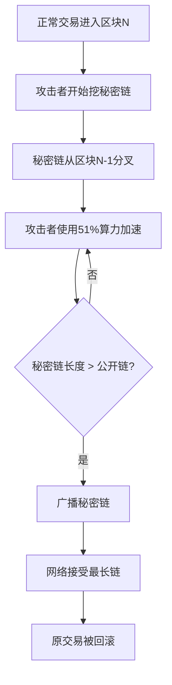

## 📖 引言

比特币作为第一个成功的去中心化数字货币，其核心创新在于解决了**"双花问题"**（Double Spending Problem）。如何用通俗易懂的方式理解这个看似复杂的技术问题？

本文通过一个生动的**典当铺比喻**，带你深入理解区块链的双花防御机制、51%攻击原理，以及"时间换空间"的核心思想。

---

## 🎭 第一幕：古老的漏洞——中心化的困境

### 故事：沈万三的第一次欺诈

从前，有个叫沈万三的商人，他有一块祖传金砖。他找到"诚信典当铺1号"，抵押金砖，换得一张**"当票A"**和一笔钱。掌柜的把**"沈万三抵押金砖一块"**记录在自己的账本上。

**沈万三动了歪心思**：他手巧，伪造了一张一模一样的**"当票A'"**。他跑到城另一头的"仁义典当铺2号"，声称要典当同一块金砖。2号掌柜没见过这块金砖，查验当票似乎无误，便也给了他钱。

**结果**：傍晚，两家典当铺掌柜对账时，发现**"同一块金砖被典当了两次"**，大惊失色！虽然最终作废了第二次交易，但沈万三已经卷钱跑路，2号典当铺蒙受了损失。

### 技术对应：传统中心化系统的双花问题

| 典当铺场景 | 技术对应 | 问题本质 |
|----------|---------|---------|
| 各家典当铺独立账本 | 银行独立数据库 | **信息不同步** |
| 伪造当票A' | 复制交易记录 | **数据可复制** |
| 利用时间差 | 网络延迟 | **缺乏全局一致性** |
| 2号铺蒙受损失 | 商家收到假币 | **无法验证资产唯一性** |

**核心问题**：在中心化系统中，如果缺乏权威机构的统一验证，同一资产（数字资产）可以被多次花费，这就是**"双花问题"**的根源。

---

## 🔄 第二幕：革命性的发明——分布式大账本

### 故事：典当联盟的诞生

全城的典当铺吃尽苦头，终于联合起来，成立了一个**"典当联盟"**。他们制定了一套全新的规则：

#### 1. 统一账本
全城100家典当铺，每家都持有一本**完全相同的、实时同步的超级大账本**。

**技术对应**：**分布式账本（Distributed Ledger）**
- 每个节点（典当铺）维护完整的账本副本
- 通过共识机制保持数据一致性
- 去中心化，无单一控制点

#### 2. 当票即交易
任何一笔典当（交易），都不再是简单的当票，而是一条全网广播的**"交易记录"**。

例如：
> **交易ID：001**  
> 沈万三的金砖编号888，从`[沈万三地址]`抵押至`[诚信1号地址]`  
> 时间戳：2024-01-01 10:00:00  
> 签名：`0x3a5f2b...`

**技术对应**：**UTXO（未花费交易输出）**
- 每笔交易记录资产的转移
- 交易用加密签名保证真实性
- 全网广播，所有节点可见

#### 3. 挖矿竞争（合账）
他们引入一种叫**"合账"**的竞赛。每十分钟，各家掌柜会竞相把这段时间收到的交易记录打包成一个**"区块"**（相当于一页账）。谁先解出一道超级难的数学题（**工作量证明**），谁就有权把这一页账（区块）发给所有人。

**技术对应**：**工作量证明（Proof of Work）**
- 矿工（掌柜）竞争打包交易
- 解决哈希难题（数学题）获得记账权
- 平均10分钟产生一个区块（比特币）

#### 4. 链式记账
新的一页账必须牢牢钉在上一页账的后面，并用数学封印（哈希值）串联起来，形成一条**"区块链"**。想改其中一页，就必须重做后面所有的页，并重新赢得每次的竞赛。

**技术对应**：**区块链（Blockchain）**
- 每个区块包含前一个区块的哈希值
- 形成不可篡改的链式结构
- 篡改历史记录的成本呈指数级增长

### 架构对比

```
传统中心化系统          vs          区块链系统
━━━━━━━━━━━━━━━━━━━━━━━━━━━━━━━━━━━━━━━━━━━━━━━━━━
单一账本（易被攻击）             分布式账本（100家店）
独立验证（信息差）               全网共识（统一验证）
可篡改（信任中心）               不可篡改（数学保证）
单点故障                         去中心化容错
```

---

## ⚔️ 第三幕：沈万三的终极挑战——51%攻击

### 故事：控制多数算力的攻击

沈万三不甘心，他决定挑战整个联盟系统。他想把典当给1号铺的金砖，再偷偷"典当"一次。

#### 攻击步骤

**第一步：正常交易**
他把金砖抵押给1号铺，交易广播全网，并被掌柜们打包进了**第100页账本**。1号铺把钱给了他。

**第二步：私下造假**
他**买通了全城超过一半（51家）的典当铺**，和他们秘密结盟。在私下，他们开始偷偷记账，创建一条**"秘密账链"**。

在这条秘密账本的第100页，他们不记录沈万三抵押给1号铺的交易，而是记录一条**"沈万三把同一块金砖抵押给了沈万三自己的另一个地址"**的伪造交易。

**第三步：跑赢时间**
现在存在两条账本链：
- **公开的诚信链**（49家诚实店铺）
- **沈万三控制的秘密链**（51家被买通的店铺）

沈万三必须让他的秘密链比公开链**长得更快**。由于他控制了超过一半的掌柜（算力），他的秘密链增长速度确实有可能超过公开链。

**第四步：偷天换日**
当秘密链比公开链**多出一页**时（比如公开链到101页，秘密链到102页），沈万三突然将秘密链向全网络公开。

**最终裁决**
根据联盟**"最长链为准"**的规则，所有诚实的掌柜都不得不接受这条更长的秘密链为"真相"。于是，包含抵押给1号铺交易的**第100页（在公开链上）被作废**，变成了"孤页"（Orphan Block）。1号铺的抵押记录凭空消失，金砖在账面上又回到了沈万三手里。

### 技术原理：51%攻击详解

#### 攻击条件

```
控制算力 > 全网算力的 51%
```

#### 攻击过程



#### 攻击成本分析

假设比特币全网算力为 **200 EH/s**（ExaHash per second）：

| 项目 | 计算 |
|------|------|
| 控制51%算力 | 102 EH/s |
| 需要矿机数量 | 约 68,000 台 Antminer S19 Pro |
| 矿机成本 | 约 $68,000,000 |
| 电力成本（年） | 约 $1,200,000,000 |
| **总成本估算** | **超过 12 亿美元/年** |

#### 攻击的局限性

即使成功发动51%攻击，攻击者**只能**：

1. ✅ **回滚自己的交易**（撤销付款）
2. ✅ **阻止其他交易确认**（暂时）
3. ❌ **无法创建新币**（违反共识规则）
4. ❌ **无法盗取他人资金**（没有私钥）
5. ❌ **无法修改历史交易**（已深度确认的交易）

### 实战案例

#### 以太坊经典（ETC）51%攻击

- **时间**：2019年1月
- **攻击结果**：双花了约 $1.1 million
- **原因**：ETC算力较小（约$11,000/小时即可控制）
- **防御**：采用检查点机制和重组保护

---

## 🛡️ 第四幕：坚不可摧的防御——时间与空间的魔法

### 核心思想：用时间换取不可篡改的空间

你的核心洞察：**联盟如何让这种攻击变得不现实？**

#### 错误的思路：缩短出块时间

> ❌ 如果他们把合账从10分钟改成1分钟（相当于比特币出块更快），沈万三的**攻击窗口期确实变短了**，但他**买通51家店铺的成本（控制51%算力的成本）并没有变**。

**分析**：
- 缩短出块时间 → 攻击窗口变短，但攻击成本不变
- 反而可能带来其他问题：网络分叉增多、安全性降低

#### 正确的思路：累积确认数（时间换空间）

**1号铺的掌柜学聪明了**：

他看到沈万三的抵押交易被记入第100页后，**并不立即放心**。他会等这条账本链后面又连续钉上了6页（**6个确认**）。

这意味着：
- 沈万三如果想篡改第100页，就必须从第101页开始
- 重做后面整整**6页的账**
- 并且每次都要在竞赛中跑赢全网络诚实的掌柜

### 数学证明：确认数与安全性

#### 攻击成功的概率

假设攻击者算力占比为 **q**，诚实网络算力占比为 **1-q**。

攻击者要在后面N个区块中全部领先的概率：

```
P(攻击成功) = (q/(1-q))^N
```

当 **q = 0.51**（51%攻击）时：

| 确认数 N | 攻击成功概率 |
|---------|------------|
| 1 | 104% （攻击者占优） |
| 3 | 113% |
| 6 | **1.3%** |
| 10 | **0.08%** |
| 20 | **0.0003%** |

**结论**：6个确认后，51%攻击成功的概率已降至 **1.3%**，基本安全。

#### 空间成本（累计工作量）

每一页账（区块）都凝聚了巨大的计算工作（解数学题）。后面每多一页，篡改的**时间成本和资金成本就呈指数级增长**。

**空间成本 = 区块高度 × 单区块工作量**

```
篡改成本 = Σ(从目标区块到最新区块的所有工作量)
         = N × 单区块算力 × 出块时间
```

当 N = 6 时：
- 比特币单区块工作量 ≈ 10分钟 × 200 EH/s
- 篡改6个区块的成本 ≈ 60分钟 × 200 EH/s × 51%
- **实际成本** ≈ **$500,000+**（仅电力成本）

### 时间换空间的精髓

| 等待时间（确认数） | 累积工作量（空间） | 攻击成本 | 安全性 |
|----------------|----------------|---------|--------|
| 0 确认 | 0 | $0 | ⚠️ 极不安全 |
| 1 确认 | 1 个区块 | ~$10,000 | ⚠️ 不安全 |
| 3 确认 | 3 个区块 | ~$30,000 | ⚠️ 基本安全 |
| **6 确认** | **6 个区块** | **~$60,000+** | **✅ 安全** |
| 10 确认 | 10 个区块 | ~$100,000+ | ✅ 非常安全 |

**你的比喻升华**：

> "你想第二次典当成功，必须跑赢50家典当铺之间的合账速度。"

更准确的说法是：

> **"你想让伪造的第二次典当被全世界接受，必须在他们记好N页真账本的同时，你一个人偷偷记好N+1页假账本，并且永远比他们快。"**

这几乎是不可能的任务！

### 实际应用：交易所确认要求

各大交易所对BTC充值的确认要求：

| 交易所 | 确认数要求 | 理由 |
|--------|----------|------|
| 小额交易 | 1-3 确认 | 快速确认，接受一定风险 |
| **标准交易** | **6 确认** | **平衡安全性与速度** |
| 大额交易 | 20+ 确认 | 最高安全性要求 |

---

## 📊 思维地图：典当铺与区块链的映射

### 完整对照表

| 典当铺场景 | 比特币/区块链概念 | 核心逻辑 |
|:----------|:----------------|:---------|
| **100家典当铺** | **去中心化节点网络** | 账本不由单一方控制，避免单点故障 |
| **统一的超级大账本** | **分布式账本（Blockchain）** | 所有人持有相同数据，信息透明 |
| **当票（交易记录）** | **UTXO（未花费交易输出）** | 资产（金砖）的转移凭证，在账本中唯一且可追溯 |
| **每日/每10分钟合账** | **区块产生与共识（PoW）** | 定期将交易打包确认，达成全局一致 |
| **沈万三伪造当票** | **双花攻击尝试** | 试图重复使用同一资产 |
| **买通51家店铺** | **51%算力攻击** | 控制大多数记账权来篡改历史 |
| **等待6页账后才放心** | **等待6个区块确认** | 通过后续工作量累积，使交易不可逆转 |
| **"跑赢合账速度"** | **比拼算力/共识速度** | 攻击者必须在算力竞赛中持续压倒诚实网络 |
| **秘密账本链** | **分叉链（Fork Chain）** | 攻击者尝试构建的替代历史 |
| **最长链为准** | **最长链规则（Longest Chain Rule）** | 网络接受累计工作量最多的链 |
| **孤页（废弃区块）** | **孤立区块（Orphan Block）** | 被分叉抛弃的区块 |
| **数学封印（哈希）** | **密码学哈希函数** | 保证区块不可篡改 |

---

## 🎯 核心机制总结

### 1. 双花问题的本质

**问题**：数字资产可以完美复制，如何防止重复花费？

**传统方案**：依赖中心化机构（银行）统一验证。

**区块链方案**：
- 分布式账本记录所有交易
- 加密签名保证交易真实性
- 共识机制确保全局一致性

### 2. 51%攻击的原理

**攻击条件**：控制超过51%的网络算力

**攻击过程**：
1. 创建秘密分叉链
2. 在分叉链上记录双花交易
3. 加速分叉链增长
4. 广播更长的链，替换原链

**攻击成本**：需要投入巨额资金购买算力

### 3. 时间换空间的防御

**核心思想**：
- **时间**：等待多个区块确认（例如6个）
- **空间**：累积的工作量证明（累计算力）

**数学保证**：
```
安全性 ∝ 确认数 × 单区块工作量
```

等待时间越长 → 累积工作量越大 → 攻击成本指数级增长 → 安全性提升

### 4. 实际应用建议

**对于普通用户**：
- ✅ 小额支付：1-3个确认即可
- ✅ 标准交易：等待6个确认（约1小时）
- ✅ 大额交易：等待20+确认（约3小时）

**对于交易所/商家**：
- 根据交易金额动态调整确认数要求
- 实施风险控制策略（如每日限额）
- 监控异常分叉和重组事件

---

## 🔬 技术延伸：其他共识机制

### 工作量证明（PoW）的替代方案

| 共识机制 | 代表项目 | 51%攻击对应 | 优缺点 |
|---------|---------|------------|--------|
| **PoW** | 比特币、以太坊（旧） | 控制51%算力 | ✅ 安全性高<br>❌ 能耗大 |
| **PoS** | 以太坊2.0、Cardano | 控制51%代币 | ✅ 节能<br>⚠️ "无利害关系"问题 |
| **DPoS** | EOS、TRON | 控制多数验证节点 | ✅ 速度快<br>❌ 中心化风险 |
| **PBFT** | Hyperledger Fabric | 控制1/3节点 | ✅ 确定性确认<br>❌ 节点数量受限 |

### 防御机制的演进

1. **检查点机制**：定期固化历史，防止长链重组
2. **重组保护**：限制最大重组深度（如ETC的检查点）
3. **最终性保证**：PoS机制的确定性确认
4. **链上治理**：通过社区投票应对攻击

---

## 📚 学习资源

### 经典论文

1. **Bitcoin: A Peer-to-Peer Electronic Cash System** (中本聪, 2008)
   - 比特币白皮书，首次提出去中心化数字货币方案

2. **Majority is not Enough: Bitcoin Mining is Vulnerable** (Eyal & Sirer, 2014)
   - 分析51%攻击和自私挖矿策略

### 推荐阅读

- [比特币开发者文档](https://bitcoin.org/en/developer-guide)
- [Mastering Bitcoin](https://github.com/bitcoinbook/bitcoinbook) - 深入理解比特币技术
- [区块链技术指南](https://github.com/yeasy/blockchain_guide) - 中文区块链技术资料

---

## 💡 思考题

1. **为什么比特币选择10分钟出块时间？**
   - 权衡：确认速度 vs 网络同步 vs 安全性

2. **6个确认是否足够安全？**
   - 取决于交易金额和风险承受能力

3. **如果攻击者控制了60%算力会怎样？**
   - 攻击成功率显著提升，但仍受时间限制

4. **未来量子计算会威胁区块链安全吗？**
   - 主要威胁加密签名，而非51%攻击
   - 需要迁移到抗量子算法

---

## 🎬 结语

通过"沈万三的典当铺"这个生动的比喻，我们深入理解了：

1. **双花问题的本质**：中心化系统的信息不同步
2. **区块链的解决思路**：分布式账本 + 共识机制
3. **51%攻击的原理**：控制多数算力重写历史
4. **时间换空间的魔法**：用确认数累积工作量，指数级提升攻击成本

**核心思想**：

> 区块链（典当联盟）通过**将物理世界的"黄金"转化为账本上的"交易记录"**，并利用**分布式共识**和**工作量证明机制**，创造了一种**"用时间（等待确认）换取安全空间（累积的不可篡改性）"**的魔法。

等待的每一个"确认"，都像是在伪造的账本页上压上一座大山。等待足够久之后，大山沉重到任何现实中的力量都无法撼动，于是我们便相信了那页账本上的记录就是**"事实"**。

这就是比特币解决双花问题的精髓，也是区块链技术的核心创新。

---

> 💎 **本文基于典当铺比喻创作，旨在用通俗易懂的方式解释区块链核心技术。如果你对某个技术细节感兴趣，欢迎深入阅读相关技术文档。**
